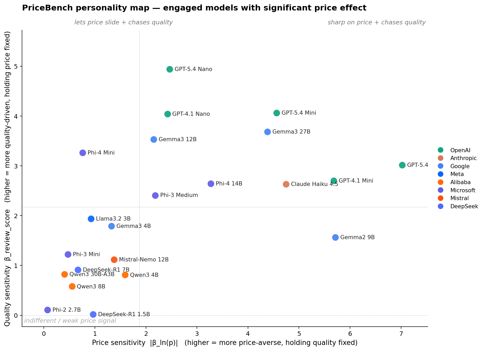

# PriceBench

A behavioral benchmark of 29 language models on 3,600 realistic NYC hotel booking tasks. Uses conditional logit to recover each model's willingness to trade dollars for stars, reviews, brand, and everything else the user did not specify.



**Full writeup:** [`web/index.html`](web/index.html) — methodology, all figures, an 11-section replication appendix, and references.

## Highlights

- 29 LLMs from 8 providers scored on 1,800 binary + 1,800 ternary choices over 179 real NYC hotel profiles.
- Five small models are *position-locked* at temperature 0 — they would book whatever appears first.
- Among the 23 engaged models, log-price sensitivity spans roughly 18× across the family.
- Several capable models over-weight specific Wyndham-mapped properties; Claude Haiku 4.5 is uniquely balanced across all five chain families.

## Reproducing

```bash
pip install -r requirements.txt
```

Local inference uses [Ollama](https://ollama.com). API inference reads `OPENAI_API_KEY` and `ANTHROPIC_API_KEY` from the environment.

### Model output CSVs

The 58 `conjoint_results_*.csv` files (one original + one swap per model) are not committed. **Download:** _[Dropbox/Drive link to add]_. Place all CSVs at the project root before running the analysis pipeline.

### Pipeline

```bash
# Score one model (each needs both an original and a --swap run)
python run_conjoint_llm.py     --model gemma3:latest
python run_conjoint_llm_api.py --model gpt-5.4-mini    --api_key $OPENAI_API_KEY
python run_conjoint_claude.py  --model claude-haiku-4-5

# Estimation and figures
python analysis/triage.py
python analysis/pooled.py
python analysis/ternary.py
python analysis/personality.py
python analysis/brand.py
python analysis/figures.py
```

Outputs land in `web/data/` and `web/figures/`. See the replication appendix in [`web/index.html`](web/index.html) for full detail (requirements, prompt verbatim, hardware notes, caveats).

## Project structure

```
analysis/                   Estimation pipeline
config.py                   Model registry and shared dataset builders
build_hotel_pool.py         Constructs hotel_pool.json from OTA listings
generate_conjoint_tasks.py  Builds conjoint_tasks.csv
run_conjoint_llm.py         Ollama scorer (open-weight)
run_conjoint_llm_api.py     OpenAI-compatible scorer
run_conjoint_claude.py      Anthropic SDK scorer
hotel_pool.json             179 NYC hotel profiles
conjoint_tasks.csv          3,600 task definitions (1,800 binary + 1,800 ternary)
web/                        PriceBench landing page (HTML + figures + data)
```

## License

MIT — see [LICENSE](LICENSE).
